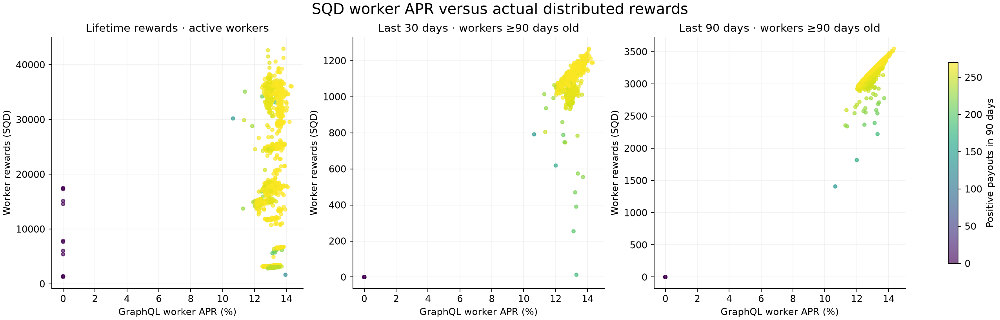

# SQD worker APR versus payouts

**Your observation is real: a lower displayed APR can accompany higher recent payouts. Higher APR is strongly associated with earnings over a comparable 90-day period, but it does not reliably rank this week's/month's payouts or lifetime rewards. It is also insufficient as a health metric.**

Snapshot: 25 September 2026, approximately 14:06–14:08 UTC. All 4,496 indexed worker identities were captured: 1,896 active, 2,551 withdrawn and 49 deregistered. The main comparison uses 1,665 active workers registered at least 90 days before the window end. Every active worker has the same 100,000 SQD bond.

## A concrete reversal

These are **operator rewards**, excluding delegator rewards. Windows end at 00:00 UTC on 25 September; rewards are assigned by their earning period's end.

| Worker | Displayed worker APR | 7-day SQD | 30-day SQD | 90-day SQD |
|---|---:|---:|---:|---:|
| ZPL_67 (#268, highest APR) | 14.33% | 284.07 | 1,189.45 | 3,546.07 |
| Magnus 50 (#2603) | 14.09% | 304.36 | 1,266.32 | 3,454.45 |
| Deutsche Telekom 29 (#670) | 14.07% | 301.53 | 1,259.41 | 3,479.26 |

Magnus 50 earned **6.46% more over 30 days** despite its lower displayed APR. This is not just an extra payout at a rotation boundary: normalizing each total by the exact duration of its included reward intervals still leaves Magnus **5.28% ahead**. Magnus's mean positive-payout APR over that month was 15.35%, versus ZPL_67's 14.58%. Its recent reward rate was higher than its longer historical average suggests. Over 90 days, ZPL_67 earned more, consistent with its higher displayed APR.

## Network-wide results

For the 1,665 mature active workers:

| Reward measure | Pearson correlation with current APR | Rank correlation (Spearman) | Node pairs where lower APR earned more |
|---|---:|---:|---:|
| Lifetime total | 0.199 | 0.296 | 39.46% |
| Last 7 days | 0.817 | 0.870 | 15.09% |
| Last 30 days | 0.831 | 0.782 | 21.07% |
| Last 90 days | 0.961 | 0.926 | 10.06% |

Pair percentages exclude ties in either APR or rewards. They describe observed rankings, not the probability of a future payout. Correlation is descriptive, not causal: APR itself is calculated partly from historical rewards.

Restricting to mature workers currently online and not jailed leaves the 30-day reversal rate essentially unchanged: **20.98%** across 1,620 workers. Among the 467 mature workers with exactly 269 positive payouts in 90 days, Pearson correlation rises to **0.997** and rank correlation to **0.989**; only **3.12%** of comparable pairs reverse. Both time horizon and payment frequency matter.

Across all 1,896 active workers, the corresponding rank correlations are 0.203 (lifetime), 0.859 (7 days), 0.795 (30 days) and 0.770 (90 days). Filtering out newly registered workers materially improves the 90-day comparison. Withdrawn/deregistered workers remain in the CSV and network totals; they are excluded from APR comparisons because a current active-node APR is not comparable to a stopped node's historical earnings.



## What the dashboard's numbers mean

The inspected upstream implementation makes several distinctions:

1. **Worker APR is a smoothed rate.** It averages recorded worker-reward APRs from the previous 90 days plus one current modeled APR observation. This is an arithmetic average of observations, not total calendar-period rewards divided by elapsed time. [Indexer calculation](https://github.com/subsquid/squid-subsquid-network/blob/302b8f19bbe7280dd0e3f60eb5242acbb19576bb/packages/workers/src/handlers/cap.ts#L93)
2. **Only positive payouts become worker-reward history rows.** Zero-reward distributions and periods in which a node is absent do not become zero observations in that historical average. A high rate when paid does not guarantee frequent payment. [Distribution handler](https://github.com/subsquid/squid-subsquid-network/blob/302b8f19bbe7280dd0e3f60eb5242acbb19576bb/packages/workers/src/handlers/rewards-distributor/Distributed.handler.ts#L198)
3. **“Total reward” is lifetime claimed plus claimable rewards.** It is not a recent daily earning rate, and claimable alone depends on when the owner last claimed. [Dashboard calculation](https://github.com/subsquid/sqd-network-app/blob/0ad8de31818a84bd343149317f27cbcc7d456b47/packages/server/src/routers/worker.ts#L83)
4. **Delegation already contributes to worker APR.** The modeled operator reward uses bond plus half the effective capped delegation, then divides by the worker's bond. Delegator APR is a separate measure. With identical worker bonds, delegation does not justify treating a given worker APR as having a different capital denominator. [Reward and APR formulas](https://github.com/subsquid/squid-subsquid-network/blob/302b8f19bbe7280dd0e3f60eb5242acbb19576bb/packages/workers/src/handlers/cap.ts#L136)
5. **The dashboard may override APR to zero for an offline, active, non-jailed worker.** The CSV retains both GraphQL APR and the value produced by this dashboard rule. The example nodes are online, so this does not affect their comparison. [Display override](https://github.com/subsquid/sqd-network-app/blob/0ad8de31818a84bd343149317f27cbcc7d456b47/packages/server/src/routers/worker.ts#L32)

For a concrete attendance discrepancy, Octopussy20 (#4113) has a 13.72% APR but only 221 positive payouts in 90 days, earning 2,777.49 SQD. In contrast, ZPL_67 received 269 positive payouts. The dataset establishes fewer payments; it does not establish whether the underlying cause was uptime, eligibility, assignment, or another network rule.

For monitoring earnings, use **actual operator SQD/day over 7 and 30 days**, positive/zero payout counts, and time since the last paid period alongside APR. An annualized calendar return can be computed as `window rewards / bond × 365 / window days × 100`; the CSV includes this for currently bonded nodes. Unlike the positive-payout average, it retains missing payment time in the denominator.

## Evidence, controls and limits

- Captured 1,088 GraphQL commitments containing 533,623 recipient records over approximately 91 days, including explicit zeros. Worker IDs, rather than mutable node names, join datasets. All 4,496 workers have rows, including those with no recent rewards.
- Reused the network configuration and `tools/health.py` distribution-event ABI to independently decode 13 recent on-chain events. **All 6,096 worker/staker reward pairs matched GraphQL exactly in integer wei.** This verifies the sampled distributions, not every historical event or lifetime balance.
- Fixed comparison windows: 18–25 September (7 days), 26 August–25 September (30 days), and 27 June–25 September (90 days), UTC. Select `start < commitment.to <= end`; payments are discrete and are not prorated. A boundary can add/remove a roughly eight-hour reward interval. Included interval durations and payout counts are exposed in the CSV; the main example remains a reversal after duration normalization.
- “Payout” here means rewards distributed/accrued to the operator, not tokens transferred to an owner's wallet by a later claim. Commitment times describe the earning interval; transaction posting can occur later.
- Source inspection is pinned to the commits linked above. The API snapshot is live but not transactionally pinned across pages, so current APR/online/delegation values can drift slightly during collection. Historical sums use the fixed cutoff. Upstream deployment revisions were not independently attested.
- This is a cross-sectional comparison of **current displayed APR against past realized earnings**, not a prospective test using APR captured at the beginning of each window. Establishing predictive power requires repeated snapshots followed by future payouts.
- Node age, equal bonds, online status and equal positive-payout counts are checked separately. Historical delegation/uptime changes were not reconstructed; their effects are already reflected in realized rewards, but no causal attribution to those factors is claimed.

## Files and reproduction

- `workers.csv`: all workers, identities, current APR/status/bond/delegation, lifetime rewards, 7/30/90-day worker and staker totals, payout counts, interval coverage and realized calendar APRs.
- `summary.json`: statistics, cohorts, top workers and on-chain validation results.
- `raw/`: local compressed public GraphQL pages and the chain sample. `raw-manifest.json` records SHA-256 hashes; raw pages are retained locally but excluded from Git to avoid adding 19 MB of captured API responses to the repository.
- `collect.py`, `verify_chain.py`, `analyze.py`: capture, cross-check and analysis scripts. Collection reuses existing pages; use an empty `raw/` directory for a fresh capture. `verify_chain.py` overwrites its chain sample, so preserve the original capture when reproducing the historical report.

From the repository root, install `requirements.txt` plus `requests numpy scipy matplotlib` in Python 3.11. For the existing local capture, run:

```sh
python analysis/NODEX-259/analyze.py
```

For a new capture, run `collect.py`, then `verify_chain.py`, then `analyze.py`. New snapshots will produce different results. The collector pins a capture-time cutoff for commitments; it does not pin live worker metadata. The source commit metadata refers to the implementations inspected for this report, not an automatically detected API deployment version.

Tracked in [NODEX-259](https://linear.app/nodexeus/issue/NODEX-259).
